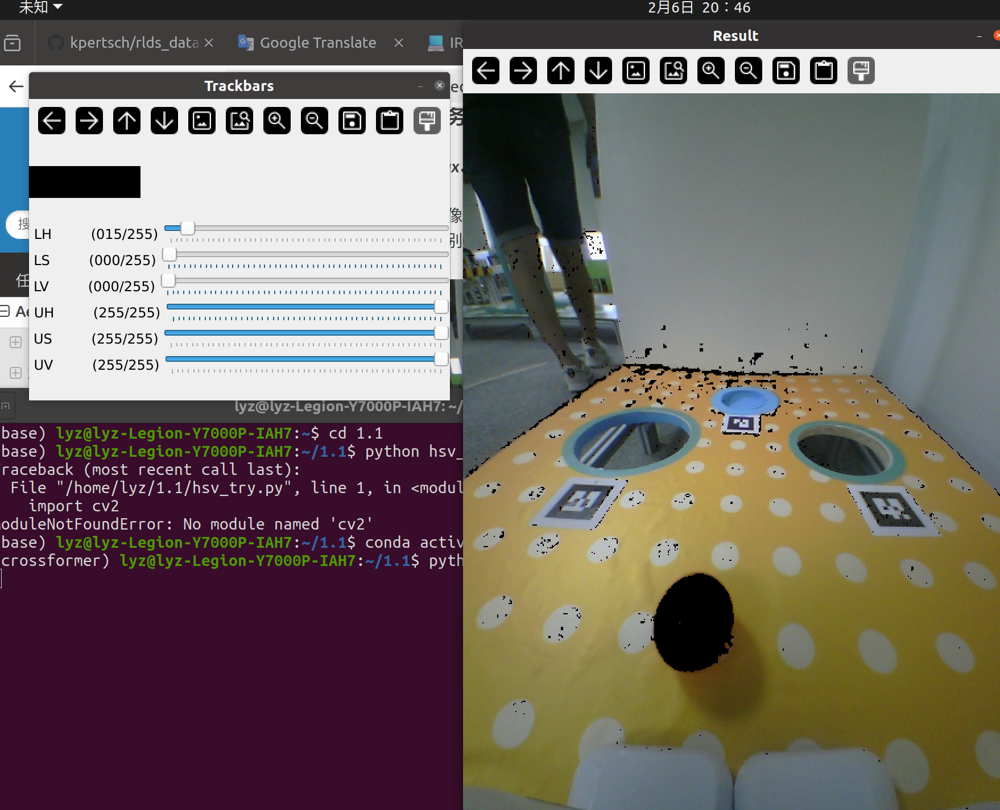

# Aelos&Roban选拔任务

## Aelos&Roban选拔任务1.1.1：opencv框选红色小球并输出坐标

#### 1.编写hsv_try.py：可手动调整HSV阈值的GUI界面：

编写1.1/hsv_try.py文件，可通过滑块对一个文件夹中的所有图片进行六个HSV阈值的调整并实时观察效果，通过"w","s","a"按键切换不同图片并保存，保存阈值在hsv_config.txt文件中，下次打开自动更新




#### 2.编写1.1.py:   opencv框选红色小球并输出坐标

从图片中裁剪特定区域并转换为HSV颜色空间，通过颜色阈值分割提取特定颜色的目标区域，进行形态学处理以优化目标区域的形态，通过轮廓检测找到目标物体并用面积大小筛选，使用红色矩形框和质心标记其位置，绘制坐标，最终显示处理后的结果，并提供可选的图片保存功能。

效果可见： https://github.com/chuchen0210/HITIRC_lyz/issues/1

## Aelos&Roban选拔任务1.1.2：编写发布者订阅者对给定图像进行处理

工作包为IRC/src/opencv，只上传了代码以及CMakeLists.txt与package.xml配置文件

效果可见：https://github.com/chuchen0210/HITIRC_lyz/issues/2

```sh
#终端1
roscore
#终端2
rosrun opencv img_pub.py
#终端3
rosrun opencv img_sub.py
#终端4
rqt_image_view
```

## Aelos&Roban选拔任务1.1.2：编写发布者订阅者对视频流进行处理，识别红色物体（苹果）

```sh
#终端1
roscore
#终端2
rosrun opencv img_pub_v.py
#终端3
rosrun opencv img_sub_v.py
```

效果可见： https://github.com/chuchen0210/HITIRC_lyz/issues/3

## Aelos&Roban选拔任务1.2：跑通yolo，将yolo识别到的物体在视频中的像素坐标通过ros话题发布

跑通yolov8，完成yolo配置，数据集标注，数据集划分（训练集，验证集8：2随机分配）模型训练，模型推理等工作，辅助工具在IRC/src/yolo/tools文件夹，包含图片与视频互相转化，数据集划分等代码，工作包为IRC/src/yolo，只上传了代码以及CMakeLists.txt与package.xml配置文件(weights为kuavo任务模型权重)

```sh
#终端1
roscore
#终端2
conda activate yolov8  #base环境没有torch
python ~/IRC/src/yolo/scripts/yolo_pub.py 
#终端3
rosrun yolo yolo_sub.py
```

使用origincar在赛道上采图并四分类训练，详细工作及效果可见：

https://github.com/chuchen0210/HITIRC_lyz/issues/4

## Aelos&Roban选拔任务1.3：SLAM任务


# Kuavo选拔任务

## Kuavo选拔任务2.1：学习论文，熟悉基于MPC（Model Predictive Control）和WBC（Whole Body Control）机器人控制框架

### **MPC（模型预测控制）基本原理**

MPC（Model Predictive Control）是一种基于模型的控制策略，常用于处理动态系统的优化问题。MPC的核心思想是通过使用系统的动态模型预测未来一段时间内的系统行为，并在每个控制周期内优化控制输入。具体来说，MPC工作流程如下：

1. **系统建模**：MPC基于机器人系统的动力学模型进行建模，描述系统的状态（如位置、速度）和输入（如力矩、接触力）。通过这些模型，MPC能够预测系统在未来一段时间内的行为。
2. **优化问题**：在每个控制周期内，MPC求解一个优化问题，通常是最小化一个代价函数（例如，位置误差、控制力矩等）并且满足系统的约束（如接触力、速度限制等）。MPC通过这种优化来决定最优的控制输入，确保机器人能够按照预定目标执行任务。
3. **滚动时域优化**：MPC使用滚动时域的方法进行实时优化，即每当控制周期到来时，MPC重新根据当前的状态和环境信息优化控制输入，确保系统能够适应动态变化的环境和任务。
4. **实时执行与反馈**：MPC计算出控制输入后，会实时执行并反馈给系统，同时基于实际执行结果进行调整，从而实现实时更新和任务执行的高效性。

### **WBC（Whole-Body Control）基本原理**

WBC（Whole-Body Control）是一种综合性控制方法，用于协调机器人身体的各个部分，在执行多任务（如行走、操控、平衡等）时进行高效的协调。WBC通过层次化的规划方式，确保机器人在完成多个任务时能够平衡各任务之间的优先级。具体来说，WBC的工作流程如下：

1. **多任务协调**：WBC通过层级二次规划（HQP）来协调多个任务的执行，每个任务都有其优先级。例如，在行走任务中，保持机器人平衡可能比精确的末端执行器位置更重要。WBC会根据任务的优先级依次执行任务。
2. **优化关节动作**：WBC根据上层任务生成的运动轨迹（如MPC生成的基座运动轨迹），优化机器人的关节动作。WBC计算出各个关节的加速度、力矩等控制指令，确保任务的顺利执行。
3. **接触力与平衡**：WBC特别关注机器人的接触力分配，确保机器人在与环境交互时保持平衡。例如，WBC会根据MPC生成的轨迹调整接触点的力，确保机器人在执行操控任务（如推拉门）时能够稳定地与环境互动。
4. **实时调整与反馈**：WBC能够根据实时的传感器反馈调整控制输入。例如，如果机器人在执行任务时遇到外部扰动（如地面不平或物体阻力），WBC能够通过调整关节运动和接触力，保证机器人继续执行任务而不失去平衡。

### **MPC和WBC的结合**

在这篇论文中，MPC和WBC结合的控制框架具有很强的互补性，二者分别解决了全局规划和局部执行的问题：

- **MPC的全局优化**：MPC负责通过机器人动力学模型生成全局运动轨迹（如基座运动、机械臂运动等），并在每个控制周期内根据当前状态和环境动态优化控制输入。MPC考虑了多种约束条件，确保任务执行的稳定性与可行性。
- **WBC的局部执行与协调**：WBC负责根据MPC提供的全局轨迹调整机器人的关节运动，处理多任务的协调，确保机器人能够在执行多个任务时保持平衡和稳定。WBC还能够实时调整接触力和姿态，保证机器人能在外部扰动下继续执行任务。

## Kuavo选拔任务2.2.1：跑通osc2四足机器人，控制其移动到指定位置，明白其中参数的含义

效果可见： https://github.com/chuchen0210/HITIRC_lyz/issues/6

**参数含义：**

-  X：机器人沿地图向前方向运动的位移（与机器人朝向无关，“向前”指地图的方向），绝对值最大为10

-  Y：机器人沿地图向左方向运动的位移（与机器人朝向无关，“向左”指地图的方向），绝对值最大为10
-  Z：机器人沿竖直方向向上运动的位移，绝对值最大为0.2
-  Yaw (deg)：机器人沿自身Z轴逆时针旋转的角度（角度制），绝对值最大为360

## Kuavo选拔任务2.2.2：跑通双足机器人，编写一个脚本来向话题/cmd_vel发送数据控制机器人以指定的速度移动

编写cmd_vel_keyboard_controller.cpp，固定速度大小，在walk状态下，通过按键向话题/cmd_vel发送geometry_msgs::Twist消息控制双足机器人前后左右以及旋转运动

```sh
rosrun humanoid_controllers cmd_vel_keyboard_controller
```


效果可见：https://github.com/chuchen0210/HITIRC_lyz/issues/8

## Kuavo选拔任务2.2.3：实现双足机器人自动切换步态的功能

编写gait_change.cpp，控制机器人在stance状态下向/cmd_vel发送不为 0 的速度可以自动切换成walk状态并运动，同时发送为 0 的速度可以自动切换为stance状态并停止

```cpp
        // 根据速度发送步态命令
        if (cmd_vel_msg.linear.x != 0 || cmd_vel_msg.linear.y != 0 || cmd_vel_msg.linear.z != 0 || cmd_vel_msg.angular.z != 0) {
            publishGaitCommand("walk");  // 速度不为零时，发送“walk”命令
        } else {
            publishGaitCommand("stance");  // 速度为零时，发送“stance”命令
        }
```

参考GaitKeyboardPublisher.cpp，通过`rosmsg show ocs2_msgs/mode_schedule`查找ocs2_msgs::mode_schedule消息类型，通过终端信息锁定mode_msg.modeSequence，mode_msg.eventTimes 与步态类型的对应关系

```cpp
// 发布步态命令
void publishGaitCommand(const std::string& gaitCommand) {
    ocs2_msgs::mode_schedule mode_msg;

    // 根据步态命令选择 modeSequence 和 eventTimes
    if (gaitCommand == "walk") {
        // walk 步态的模式序列和时间点
        mode_msg.modeSequence = {1, 3, 2, 3};  // LC, STANCE, RC, STANCE
        mode_msg.eventTimes = {0.0, 0.45, 0.6, 1.05, 1.2};
    } else if (gaitCommand == "stance") {
        // stance 步态的模式序列和时间点
        mode_msg.modeSequence = {3};  // STANCE
        mode_msg.eventTimes = {0.0,1000.0};
    }

    // 发布步态命令
    gaitPublisher_.publish(mode_msg);
}
```

```sh
#放在humanoid_controllers工作包下
rosrun humanoid_controllers gait_change
```

效果可见：https://github.com/chuchen0210/HITIRC_lyz/issues/9

## Kuavo选拨任务3.1：跑通yolo，将yolo识别到的物体在视频中的像素坐标通过ros话题发布

同Aelos&Roban选拔任务1.2，效果可见：https://github.com/chuchen0210/HITIRC_lyz/issues/4

## Kuavo选拨任务3.2：YOLO：使用门把手数据集进行训练并验证

将学长提供的数据集与自己的数据集（手机采图并标注）一起训练，将学长数据集图片转化为视频与手机采的视频合并，进行推理验证。模型权重文件在IRC/srcyolo/weights文件夹下

效果可见：https://github.com/chuchen0210/HITIRC_lyz/issues/5

## Kuavo选拨任务3.3：YOLO：加入卡尔曼滤波，增强跟踪效果

使用IRC/srcyolo/weights/best.pt模型权重，加入卡尔曼滤波效果，当yolo检测对象为空时，卡尔曼滤波的添加可使得yolo短时间内仍然保持跟踪，代码实现在IRC/src/yolo/scripts下的kalman.py与yolo_kf_pub.py中

下图为yolo检测为空时，有无卡尔曼滤波的结果对比：


关键代码：

```cpp
# 运行YOLO模型进行目标检测
results = model(frame)

# 处理YOLO检测到的目标
detection = None
for result in results:
    for box in result.boxes:
        x1, y1, x2, y2 = map(int, box.xyxy[0])  # 获取边界框坐标
        x_center = (x1 + x2) / 2.0
        y_center = (y1 + y2) / 2.0
        label = model.names[int(box.cls[0])]
        
        detection = (x_center, y_center)  # YOLO的实际检测值

        # 使用卡尔曼滤波器来预测目标的中心位置
        predicted_x, predicted_y = tracker.update(detection)

        # 发送ROS话题，包含目标类别和预测位置
        bbox_msg = f"{label},{predicted_x},{predicted_y}"
        bbox_pub.publish(bbox_msg)

# 如果YOLO丢失目标，使用预测位置
if detection is None:
    predicted_x, predicted_y = tracker.update(None)
```


使用cv2.circle与cv2.putText凸显效果                
```cpp
# 可视化：在图像上绘制卡尔曼预测的目标位置
frame = results[0].plot()
cv2.circle(frame, (predicted_x, predicted_y), 5, (0, 0, 255), -1)  # 红色：预测值
font = cv2.FONT_HERSHEY_SIMPLEX
cv2.putText(frame, f"Handler: ({predicted_x}, {predicted_y})", (predicted_x, predicted_y-10), font, 0.5, (0, 255, 0), 1, cv2.LINE_AA)
```

效果可见：https://github.com/chuchen0210/HITIRC_lyz/issues/7

